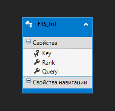

# Full-Text Search and ADO.NET Entity Framework 6
`(картинка EF with Full-Text Search in Linq really?)`

Хабр, привет! Хочу поделиться своим костылем в решении довольно банальной проблемы: как подружить полнотекстовый поиск MS SQL c Entity Framework. Тема очень узкоспециальная, но как мне кажется, актуальна на сегодняшний день. Интересующихся прошу под кат.
# Все началось с боли
Я разрабатываю проекты на C# (ASP.NET) и иногда пишу микросервисы. В большинстве случаев для работы с данными я использую базу данных MSSQL. В качестве связующего звена между базой данных и моим проектом используется Entity Framework. С EF я получаю широкие возможности для работы с данными, формирования правильных запросов, регулирования нагрузки на сервер. Волшебный механизм LINQ просто очаровывает своими возможностями. Спустя годы я уже и не представляю более быстрые и удобные способы по работе с базой данных. Но как и практически любая ORM, EF имеет ряд недостатков. Во первых это производительность, но это тема отдельной статьи. А во вторых - это покрытие возможностей самой базы данных.
В MS SQL есть встроенный полнотекстовый поиск который работает “из коробки”. Для выполнения полнотекстовых запросов можно воспользоваться встроенными предикатами (CONTAINS и FREETEXT) или функциями (CONTAINSTABLE и FREETEXTTABLE). Есть только одна проблема: EF не поддерживает полнотекстовые запросы, от слова совсем!
Приведу пример из реального опыта. Допустим у меня есть таблица статей - Article, и я создаю для нее класс описывающий эту таблицу:
```sharp
/// c#
public partial class Article
{
    public int Id { get; set; }
    public System.DateTime Date { get; set; }
    public string Text { get; set; }
    public bool Active { get; set; }
}
```
Потом мне надо сделать выборку из этих статей, скажем, вывести последние 10 опубликованных статей:
```sharp
/// c#
dbEntities db = new dbEntities();
var articles = db.Article
	.Where(n => n.Active)
	.OrderByDescending(n => n.Date)
	.Take(10)
	.ToArray();
```
Все очень красиво пока не появляется задача добавить полнотекстовый поиск. Поскольку поддержки полнотекстовых функций выборки в EF нет (в .NET core 2.1 уже частично [есть](https://docs.microsoft.com/en-us/dotnet/api/microsoft.entityframeworkcore.sqlserverdbfunctionsextensions.freetext?view=efcore-2.1])) то остается либо использовать какую-то стороннюю библиотеку, либо написать запрос на чистом SQL.

SQL запрос из примера выше не такой уж и сложный:
```sql
SELECT TOP (10) 
[Extent1].[Id] AS [Id], 
[Extent1].[Date] AS [Date], 
[Extent1].[Text] AS [Text], 
[Extent1].[Active] AS [Active]
FROM [dbo].[Article] AS [Extent1]
WHERE [Extent1].[Active] = 1
ORDER BY [Extent1].[Date] DESC
```
В реальных проектах все обстоит не так просто. Запросы к базе данных на порядок сложнее и поддерживать их в ручную сложно и долго. В результате первое время я писал запрос с помощью LINQ, потом доставал сгенерированный текст SQL запроса к БД, и уже в него внедрял полнотекстовые условия выборки данных. Далее отправлял это в `db.Database.SqlQuery` и получал нужные мне данные. Это все конечно хорошо пока на запрос не нужно навешать десяток различных фильтров со сложными join-нами и условиями.

Итак - у меня есть конкретная боль. Надо ее решать!
# В поисках решения
В очередной раз сидя в своем любимом поиске в надежде отыскать хоть какое-то решение я наткнулся на [этот репозиторий](https://github.com/fissoft/Fissoft.EntityFramework.Fts). С помощью этого решения можно внедрить в LINQ поддержку предикатов (CONTAINS и FREETEXT). Благодаря поддержки EF 6 специального интерфейса [`IDbCommandInterceptor`](https://docs.microsoft.com/en-us/dotnet/api/system.data.entity.infrastructure.interception.idbcommandinterceptor?view=entity-framework-6.2.0), позволяющего делать перехват готового запроса SQL, перед отправкой его в БД и было реализовано данное решение. В поле `Contains` подставляется специальная сгенерированная строка маркер, а потом после генерации запроса это место заменяется на предикат  Пример:
```sharp
/// c#
var text = FullTextSearchModelUtil.Contains("code");
    db.Tables.Where(c=>c.Fullname.Contains(text));
```
Однако если выборку данных нужно отсортировать по рангу совпадений, то это решение уже не подойдет и придется писать SQL запрос вручную. По сути, это решение, подменяет обычный LIKE на выборку по предикату.

Итак, на этом этапе у меня встал вопрос: можно ли реализовать реальный полнотекстовый поиск с помощью встроенных функций MS SQL (CONTAINSTABLE и FREETEXTTABLE) чтобы все это генерировалось через LINQ да еще и с поддержкой сортировки запроса по рангу совпадений? Как оказалось, можно!
# Реализация
Для начала нужно было разработать логику написания самого запроса с помощью LINQ. Поскольку в реальных SQL запросах с полнотекстовыми выборками чаще всего используют JOIN для присоединения виртуальной таблицы с рангами, я решил пойти по этому же пути и в LINQ запросе. Вот пример такого LINQ запроса:
```sharp
/// c#
var queryFts = db.FTS_Int.Where(n => n.Query.Contains(queryText));

var query = db.Article
    .Join(queryFts, article => article.Id, fts => fts.Key, (article, fts) => new
    {
        article.Id,
        article.Text,
        fts.Key,
        fts.Rank,
    })
    .OrderByDescending(n => n.Rank);
```
Такой код еще нельзя было скомпилировать, но он уже визуально решал задачу по сортировке результирующих данных по рангу. Оставалось реализовать его на практике.

Дополнительный класс `FTS_Int` используемый в данном запрос:
```sharp
/// c#
public partial class FTS_Int
{
    public int Key { get; set; }
    public int Rank { get; set; }
    public string Query { get; set; }
}
```
Название было выбрано не случайно, так как ключевой столбец в этом классе должен совпадать по тику с ключевым столбцом в таблице поиска (в моем примере с `[Article].[Id]` тип `int`). В случае если нужно делать запросы по другим таблицам с другими типами ключевых столбцов, я предполагал просто скопировать подобный класс и создать его Key того типа который нужен.

Само условие для формирование полнотекстового запроса предполагалось передавать в переменной `queryText`. Для формирование текста этой переменной была реализована отдельная функция:
```sharp
/// c#
string queryText = FtsSearch.Query(
    dbContext: db, // текущий контекст БД, нужен для формирования правильных имен таблиц
    ftsEnum: FtsEnum.CONTAINS, // тип запроса: CONTAINS или FREETEXT
    tableQuery: typeof(News), // тип таблицы по которой делается запрос
    tableFts: typeof(FTS_Int), // тип вспомогательного класс
    search: "text"); // условие полнотекстового поиска
```
Выполнение готового запроса и получение данных:
```sharp
/// c#
var result = FtsSearch.Execute(() => query.ToList());
```
Последняя функция `(FtsSearch.Execute)` обертка используется для временного подключения интерфейса `IDbCommandInterceptor`. В примере приведенном по ссылке выше автор предпочел использовать алгоритм подмены запросов постоянно для всех запросов. В результате после подключения механизма замены запросов в каждом запросе ищется необходимая комбинация для замены. Мне такой вариант показался расточительным, поэтому выполнение самого запроса данных выполняется в передаваемой функции, которая перед вызовом подключает автозамену запроса а после вызова - отключает. 
# Применение
Я использую автогенерацию классов моделей данных из БД с помощью файла edmx. Поскольку просто созданный класс `FTS_Int` использовать в EF нельзя по причине отсутствия необходимых метаданных в `DbContext`, я создал реальную таблицу по его модели (может кто знает способ получше, буду рад вашей помощи в комментариях):

_Скриншот таблице созданной в файле edmx_



```sql
/// Текст SQL запроса для создания таблицы
CREATE TABLE [dbo].[FTS_Int] (
    [Key]   INT          NOT NULL,
    [Rank]  INT          NOT NULL,
    [Query] NVARCHAR (1) NOT NULL,
    CONSTRAINT [PK_FTS_Int] PRIMARY KEY CLUSTERED ([Key] ASC)
);
```
После этого при обновлении файла edmx из БД добавляем созданную таблицу и получаем ее сгенерированный класс:
```sharp
/// c#
public partial class FTS_Int
{
    public int Key { get; set; }
    public int Rank { get; set; }
    public string Query { get; set; }
}
```
Запросы к этой таблице вестись не будут, она лишь нужна,чтобы правильно сформировались метаданные для создания запроса. Финальный пример использования полнотекстовых запрос к БД:
```sharp
/// c#
string queryText = FtsSearch.Query(
    dbContext: db,
    ftsEnum: FtsEnum.CONTAINS,
    tableQuery: typeof(Article),
    tableFts: typeof(FTS_Int),
    search: "text");

var queryFts = db.FTS_Int.Where(n => n.Query.Contains(queryText));

var query = db.Article
    .Where(n => n.Active)
    .Join(queryFts, article => article.Id, fts => fts.Key, (article, fts) => new
    {
        article,
        fts.Rank,
    })
    .OrderByDescending(n => n.Rank)
    .Take(10)
    .Select(n => n.article);

var result = FtsSearch.Execute(() => query.ToList());
```
Также есть поддержка асинхронных запросов:
```sharp
/// c#
var result = await FtsSearch.ExecuteAsync(async () => await query.ToListAsync());
```
SQL запрос сформированный до автозамены:

```sql
SELECT TOP (10) 
    [Project1].[Id] AS [Id], 
    [Project1].[Date] AS [Date], 
    [Project1].[Text] AS [Text], 
    [Project1].[Active] AS [Active]
    FROM ( SELECT 
        [Extent1].[Id] AS [Id], 
        [Extent1].[Date] AS [Date], 
        [Extent1].[Text] AS [Text], 
        [Extent1].[Active] AS [Active], 
        [Extent2].[Rank] AS [Rank]
        FROM  [dbo].[Article] AS [Extent1]
        INNER JOIN [dbo].[FTS_Int] AS [Extent2] ON [Extent1].[Id] = [Extent2].[Key]
        WHERE ([Extent1].[Active] = 1) AND ([Extent2].[Query] LIKE @p__linq__0 ESCAPE N'~')
    )  AS [Project1]
    ORDER BY [Project1].[Rank] DESC
```
SQL запрос сформированный после автозамены:
```sql
SELECT TOP (10) 
    [Project1].[Id] AS [Id], 
    [Project1].[Date] AS [Date], 
    [Project1].[Text] AS [Text], 
    [Project1].[Active] AS [Active]
    FROM ( SELECT 
        [Extent1].[Id] AS [Id], 
        [Extent1].[Date] AS [Date], 
        [Extent1].[Text] AS [Text], 
        [Extent1].[Active] AS [Active], 
        [Extent2].[Rank] AS [Rank]
        FROM  [dbo].[Article] AS [Extent1]
        INNER JOIN CONTAINSTABLE([dbo].[Article],(*),'text') AS [Extent2] ON [Extent1].[Id] = [Extent2].[Key]
        WHERE ([Extent1].[Active] = 1) AND (1=1)
    )  AS [Project1]
    ORDER BY [Project1].[Rank] DESC
```
По умолчанию полнотекстовый поиск работает по всем столбцам таблицы:
```sql
CONTAINSTABLE([dbo].[Article],(*),'text')
```
Если нужно сделать выборку только по некоторым полям, то их можно указать в параметре fields функции `FtsSearch.Query`.
# Итого
Результат - поддержка полнотекстового поиска в LINQ. 

Нюансы данного подхода.

1. Параметр search в функции `FtsSearch.Query` не использует каких либо проверок или оберток для защиты от SQL инъекций. Значение этой переменной передается как есть в текст запроса. Если есть какие то идеи по этому поводу пишите в комментариях. Я же использовал обычное регулярное выражение которое просто убирает все символы отличных от букв и цифр.

2. Также нужно учитывать особенности построения выражений для полнотекстовых запросов. Параметр в функцию ```sql CONTAINSTABLE([dbo].[News],(*),'Новое исследование')``` имеет недопустимый формат так как MS SQL требует разделения слов логическими литералами. Чтобы запрос был выполнен успешно нужно исправить его так:
```sql CONTAINSTABLE([dbo].[News],(*),'Новое and исследование')```
или изменить функцию выборки данных
```sql FREETEXTTABLE([dbo].[News],(*),'Новое исследование').```
За более подробной информацией об особенностях создания запросов лучше обратиться к [официальной документации](https://docs.microsoft.com/ru-ru/sql/relational-databases/search/full-text-search?view=sql-server-2017).

3. Стандартное логирование с таким решением работает некорректно:
```sharp
/// c#
db.Database.Log = (val) => Console.WriteLine(val);
```
Если посмотреть на сформированный запрос к базе данных то он будет сформирован до обработки функциями автозамены.

В ходе тестирования я проверял и на более сложных запросах со множественными выборками из разных таблиц и здесь не возникло никаких проблем.


